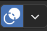

# Quick Start Guide

## Introduction

Blender is a 3D program with a 2D package built-in. Some voices can be heard saying that Blender *looks very complicated*, but it is in fact a very streamlined and simple program even for 2D Animation. At least we are working at making it so.

At SPA we are developing our own studio-specific Blender with a set of UI changes and tools to ease newcomers to it and continue refining its capabilities based on your direct production feedback.
**This document aims to give you the basic knowledge to quickly start Animating with the SPA version of Blender**.

Let's get started.

- - - - - -

## Install and launch Blender SPA

TODO: Write launch instructions for the outside world.

- - - - - -

## Open SPA 2D Animation Template

The first time you launch Blender you will be see the Blender Splash Screen. On the right is a list of recent files, on the left is templates to create a new file from. To get started in the SPA Animation experience select **`SPA 2D Animation`** template.

After launching the template you will see the default SPA Animation workspace. This workspace is opened on a drawing canvas in Draw Mode, you can now begin drawing your first keyframe.

#### Return to the Splash Screen

You can always re-open the Splash Screen by using the **Blender Logo &gt; Splash Screen** in the top right corner of your Blender window. This will re-open the Splash Screen which usually appears when you first launch Blender.

- - - - - -

## Interface Basics

- **Green: Toolbar** This area contains tools like the Draw tool, Eraser tool and the Quick Edit tool.
- **Yellow: Drawing Space **This area is your canvas for drawing.
- **Blue: Timeline/Dope Sheet **The Dopesheet is where animation keyframes can be viewed/moved
- **Red: Quick Access Panel **The Quick Access panel is where you will find shortcuts for most Animation work

- - - - - -

## Navigation

Middle Mouse Action will in the future be set by default for artists launching Blender, temporarily please follow the below procedure to ensure you have the correct navigation settings.

#### Set your Middle-Mouse Preference right!

By default the Middle Mouse Button in Blender will Orbit around your object in 3D Space,  **which is not desirable for 2D artists.**

Before you start, Open **Edit&gt;Preferences** find the **Keymap** section from the sidebar of the preferences window. And set **Middle Mouse Action** to **Pan** as the default *(instead of Orbit).* 

- - - - - -

#### Basic Navigation of your Canvas

To quickly navigate your scenes, Blender has some handy keyboard shortcuts. These come in the form of **Zoom, Pan,** and **Rotate Canvas** Shortcuts.

Also do not forget to press the **ESC** key if you get lost or performed an operation you are not sure about and want to get out of. Or press the camera icon to get back to default view

1. **Pan:** Move your Pen/Mouse ***Left and Right*** or ***Up and Down*** while Holding Down the **Middle Mouse Button** to pan the Canvas
2. **Zoom:** Move your Pen/Mouse ***Up and Down*** while Holding Down **CTRL + Middle Mouse Button**  to zoom in/out
3. **Rotate Canvas:** Move your Pen/Mouse and Hold Down **SHIFT** + **CTRL + Middle Mouse Button**,
    - Use **CTRL + SHIFT + R** or the Blue Rest Icon in the lower center of your screen to reset your Rotated Canvas
4. **Mirror Canvas:** **SHIFT+ W** to mirror canvas at the current views center. **SHIFT+W** again to reset.

- - - - - -

## Your first strokes

To begin drawing in Blender simply start drawing in the Drawing Space/Canvas area. Use the Dope Sheet to navigate to a new frame and use `I` on your keyboard to insert a keyframe.

#### **Radius**

The **Radius** of a **Brush** can be controlled in the Header menu. The use pressure button allows for tablet pressure inputs on the **Radius**. You can quickly adjust the **Radius** with “F” on the Keyboard. Under the **Tools&gt;Brush Settings&gt;Radius** menu a custom curve can be set for the strength for more precise control.

#### **Strength**

The **Strength** is how Dark the stroke is, this can also be controlled by pen pressure. To set the **Strength**, edit it in the header menu, under the tools panel or use the keyboard shortcut SHIFT+F. Under the panel **Tools&gt;Brush Settings&gt;Strength** menu a custom curve can be set for the strength for more precise control.

- - - - - -

## Changing Colors

In the Quick Access Panel under the header **Colors** is a menu to select different colors for your drawing. Simply select one of the preset colors and continue drawing in the newly selected color!

## Erase a Stroke

To remove a stroke with the Eraser tool, select the **Eraser** from the Toolbar on the left. You can now erase strokes, use the **Strength** to adjust how effective your Eraser is. Select the **Stroke** option to quickly erase entire strokes.

- - - - - -

## Edit a Stroke

To Edit a stroke, find the Quick Select tool on the left Toolbar area. Using the Quick Edit tool users can manipulate strokes. This transform box works similar to transform boxes in other 2D Animation software.

*To learn more see [Quick Edit Tool](#quick-edit-tool) doc.*

- - - - - -

## Enable SPA Theme

Dopesheet now has an updated look over vanilla blender to make it easier to read. You must have the **SPA Theme** enabled to do this follow the [Enable SPA Theme page](#enable-spa-theme).

1. Navigate to **Edit&gt;Preferences**
2. Open the **Theme** tab
3. Select the SPA theme from the **Dropdown**

- - - - - -

## Navigating Between Drawings

There are several ways to switch the active layer, it can be selected from the Drawing Box or the Dope Sheet area, as shown in [Layer Management. ](#layer-management)To jump between layers and grease pencil objects in the viewport we have the shortcuts **CTRL+SHIFT+CLICK** and **ALT+CLICK.**

#### **From the Viewport**

1. Enabled **Fade Inactive Objects** + **Grease Pencils** from the overlays menu
2. Enabled **Fade Inactive Layers** from the overlays menu
    - Users can adjust the Fade opacity of inactive objects (set to .5 by default)
3. Hover your Mouse/Pen over the stroke of an inactive drawing
4. **Ctrl+Shift** and **Click** to make inactive drawing active
5. **Alt + Click** to make an inactive layer in the current drawing active

#### **From the Dope Sheet**

1. Ensure you have **Sync Selection **enabled in the Dopesheet header.
2. Select different layers in the Dopesheet the active object will update.

- - - - - -

## Always show Active Drawing in Dope Sheet

In Blender there is a a concept between active and selected. This means it is possible to have a drawing being edit-able but not appear in the Dopesheet. To avoid this issue enable the option **Always Show Active** under the Dopesheet header.

1. Ensure you are in **Draw Mode**.
2. From the Dopesheet header select the  icon.
3. Use the  icon to enable **Always show Active Object**

- - - - - -

## Further Reading

- **Drawing Tools**
    - [Brushes &amp; Materials](#brushes-materials)
    - [Layer Management](#layer-management)
    - [Quick Edit Tool](#quick-edit-tool)
    - [Select Layer from Viewport](#select-layer-from-viewport)
    - [Rotating the Canvas in 2D](#rotating-the-canvas-in-2d)
- **Animation Tools**
    - [Keyframing Drawings](#keyframing-drawings)
    - [Current Keyframe Box](#current-keyframe-box)
    - [Flipping Box](#flipping-box)
    - [Onion Skinning Box](#onion-skinning-box)
- **References**
    - [Shift &amp; Trace Box](#shift-and-trace-box)
    - [Import Image as Reference](#import-image-as-reference)# Start Drawing

The basic tools needed to start drawing in Blender.

# Brushes & Materials

Pens or Brushes in Blender can be selected only when in **Draw Mode**. Pens will always define the shape or style of the stroke and can also sometimes define material or color of the stroke. The same pen can be used with multiple materials/colors.

1. Pens can be selected from the top left menu. (only when in draw mode)
2. Materials are defined in the **Storyboarding Panel** by Pallet

    - Select a pallet under either [**Material** ](https://docs.blender.org/manual/en/latest/grease_pencil/materials/introduction.html)or [**Vertex Color**](https://docs.blender.org/manual/en/latest/grease_pencil/modes/vertex_paint/introduction.html)
3. **Vertex Colors** can be defined manually, allowing for quick custom color changes and Palette definitions.

# Layer Management

Each [**Grease Pencil Object**](https://docs.blender.org/manual/en/latest/grease_pencil/introduction.html) contains its own set of layers. Layers in Blender work very similar to other 2D programs like Harmony. Layers can be ordered top to bottom to create a hagiarchy and easily hidden/locked.

- - Hide Icon
    - Lock Icon
    - Onion Skinning
    - Layer Opacity
    - Add/Remove Active Layer
    - Up/Down Active Layer

# Add New Drawing Objects

To begin drawing in Blender you will need a [**Grease Pencil Object**](https://docs.blender.org/manual/en/latest/grease_pencil/introduction.html). Blender manages different sets of drawings inside of this **Grease Pencil Object**. It contains all data related to drawings including colors and layers. The **Grease Pencil Object** represents a 2D plane that drawings exist on. This object can be transformed and rotated in 3D space depending on the complexity of your scene.

1. Select the "plus" icon to create a new drawing object
2. A “New Drawing Object” dialogue will open

    1. Name: Enter name based on convention TBD
    2. Location: This gives options to control where the object is in 3D space
        - View Offset: Will place object in 3D relative to the camera’s position
        - 3D Cursor: Will place object in 3D at a fixed point via [3D Cursor](https://docs.blender.org/manual/en/latest/editors/3dview/3d_cursor.html?highlight=3d%20cursor)
    3. View Offset: Set distance of object relative the camera’s position
        - The “Pin to Camera” button See [Pinning Drawings…](#introduction-to-drawing-toolbox#bkmrk-pinning-drawings-to-)
    4. Orient Axis: Restrict orientation to the select axis.
3. The newly created object will appear in the object list

# Switching Between Drawings & Layers

We can use the shortcut **Ctrl+Shift+Click** to jump between objects while selecting them directly in the Viewport or while selecting the object in the list of Objects in the **Drawings Panel**. This feature, in combination with the setting to **Fade in Active Objects** allows us to now clearly ***differentiate*** which object is active and which is inactive and to what level, and jump between them easily.

1. Ensure you are in **Draw Mode**
2. Ensure you have **Sync Selection **enabled in the dopesheet header.
3. Enabled **Fade Inactive Objects** + **Grease Pencils** from the overlays menu
4. Enabled **Fade Inactive Layers** from the overlays menu
    - Users can adjust the Fade opacity of inactive objects (set to .5 by default)
5. Hover your Mouse/Pen over the stroke of an inactive drawing
6. **Ctrl+Shift** and **Click** to make inactive drawing active
7. **Alt + Click** to make an inactive layer in the current drawing active
8. Notice the Drawing Panel updates which drawing is updated

# Working with Palettes

## Importing Existing Palette

Palettes are predefined groups of materials.

SPA provides a couple of palettes by default and some of these are provided in the Animation and Layout template files.

- - - - - -

## Create a new Palette

Palettes are based on existing Grease Pencil Objects. Palette's are defined by materials with a prefix in their name. 

To create a new Palette we simply add a new material with a new prefix. Using a / to separate the palette from the material's name. The palette items are saved inside your Grease Pencil Object!

For example: `MyPalette/Color`

1. Open the Material's Tab with a Grease Pencil Active
2. Use the + Button to Add a new Material
3. Rename your material with palette title `MyPalette` as a prefix followed by `/`
4. Name your new material now, and set its color
5. Refresh your palettes to see your new palette in the side panel.

# Mirror the Viewport

Mirroring the Viewport can be done either from the Storyboard side panel or a keyboard shortcut

1. Move your viewport to the item to be mirrored
2. From the Side Panel select the  icon\]
3. Or use keyboard shortcut **SHIFT+ W**

**Notice:** When viewport is mirrored, the butterfly icon will turn red:  and the top left will read **Camera Perspective** **(Mirrored)** if text info is enabled in the overlays menu.

# Enable SPA Theme

SPA has a special theme to make it easier to read the Dopesheet. To enable the SPA theme follow these instructions.

1. Navigate to **Edit&gt;Preferences**
2. Open the **Theme** tab
3. Select the SPA theme from the **Dropdown**

## **What's new in the SPA Theme**

Dopesheet now has an updated look over vanilla blender to make it easier to read.

- **Active Object** has a Light Blue Highlight on it's row
- **Active Layer** has a Light Green Highlight
- **Inactive Object** has a Dark Blue Highlight
- **Inactive Layer** has a Dark Green Highlight

# Edit Drawings

How to edit your drawings, and navigate between different layers.

# Quick Edit Tool

Similar to the selection tool in Harmony. The **Quick Edit tool** allows you to quickly select and transform any stroke within the **[Grease Pencil Object](https://docs.blender.org/manual/en/latest/grease_pencil/introduction.html).** It can be selected from the left Toolbar.

### Selection &amp; Move

Use the tool select and move a stroke in a [**Grease Pencil Object**](https://docs.blender.org/manual/en/latest/grease_pencil/introduction.html)**.** Keyboard shortcuts allow for a more precise movement. The mouse cursor will display a hand icon when move is available.

1. Use the **Quick Edit tool** to lasso a selection
2. Click and Drag with Mouse/Pen on the transform box to move
3. CTRL+ARROW KEY moves 1px
4. CTRL+SHIFT+ARROW KEY moves 5px
5. SHIFT+ Selection will add to the section
6. CTRL + Selection will subtract from the selection
7. Select blank canvas to deselect
    

### Select/Deselect All

All strokes on the current frame can be selected and deselected with **A** or **Alt+A
**

1. Use ‘A’ while Quick Edit tool is enabled to select all strokes on the current frame
2. Use ‘ALT + A’ while Quick Edit tool is enabled to deselect all strokes on the current frame

### Scaling

**Scale** any selection either freely or while maintaining proportions. Scaling can also be done around the Pivot Point. Scaling is enabled when hovering over any point on the transform box. The mouse cursor will display a four way arrow when scaling is available.

1. Select a drawing and select any point to **Scale**
2. Hold SHIFT to Proportionally **Scale**
3. Hold ALT to **Scale** around the opposite corner
4. Hold SHIFT+ALT to **Scale** Proportionally around the opposite corner

### Rotate and adjust Pivot Point

**Rotate** your selection from any corner. Adjust the pivot point for more advanced rotations. **Rotation mode** is available when the Mouse Cursor is in a + shape.

1. Select Drawing and drag near any corner to rotate.
2. Adjust pivot point to affect the rotation’s origin.

### Skewing

**Skewing** a drawing can be done from any side. **Skewing mode** is enabled when hovering along the length of the transform box. The mouse cursor will display a bidirectional arrow along the skew axis when available.

1. Hover mouse/pen over transform box line
2. Click and drag to skew
3. Hold ALT to skew about the pivot point

### Copy &amp; Paste

Strokes can quickly be selected for copying to another frame or for duplication using the selection tool. 

1. Make a selection
2. Use Ctrl + C to copy
3. Use Ctrl + V to paste

### Duplication

1. Make a selection
2. Use SHIFT + D to duplicate
3. Move the duplication with either the mouse or keyboard shortcuts
4. Use X to move duplication horizontally 
5. Use Z to move duplication vertically

### Delete 

Strokes can quickly be deleted either an entire drawing or a portion of the drawing selected.

1. Draw a selection
2. Hit "X" to delete. 

### Move Selection to Layer

Strokes can quickly move to another layer using ‘M’ on your keyboard.

1. Draw a selection
2. Hit "M” to Move to Layer
3. Select a destination layer

    

### Flip Strokes

1. Draw a selection
2. Use the Flip buttons in the Top Left header to mirror X/Y
3. Mirror works on the current keyframe and can be animated across keyframes

# Select Layer from Viewport

Select Layer from Viewport is a shortcut to quickly change the active layer while drawing.

Select a layer by Alt clicking a stroke in your viewport. Ensure you have “fade inactive layers” enabled, this will visualize the change in active layer. ALT+LEFT CLICK over drawings to switch to that drawing’s layer. The newly active layer will now be highlighted in the Drawings toolbox.

1. Under Viewport Overlays  ensure Fade Layers is enabled. 
2. ALT + LEFT CLICK over a stroke to make it’s layer active

# Rotating the Canvas in 2D

To rotate the current view use the Rotate Canvas shortcut. Can be used anywhere in the viewport.

1. From either Camera or 3D View
2. Keyboard Shortcut SHIFT+CTRL+MIDDLE MOUSE BUTTON
3. The Blue gizmo will help orient your rotation. At the button an reset icon will appear to show rotation is being used.
4. Use the  icon to reset the view. Or use shortcut SHIFT+CTRL+R

# Pegbars

Pegbars are for offsetting, rotating and scaling individual Grease Pencil Layers. Pegbars are for only transforming layers inside 2D space. The peg bar system will always aligned with a Grease Pencil Object's drawing plane.

- - - - - -

### **Add Pegbar to Grease Pencil Object**

1. To create Pegbars select “Create Pegbar” in the Side Panel
2. A new Pegbar will be created at the center view

- - - - - -

### **Parent Peg to Layer**

1. To parent a peg to a layer select the layer in the Drawings Box
2. Then under **Peg:** select the Peg that will be the parent of this layer

- - - - - -

### **Transform Pegs**

1. To transform a peg firstly ensure that the desired peg is active in the Pegbars Box
2. From the Toolbar on the left select the **BLANK** icon under the **Shift and Trace** icon
3. A green transform gizmo will appear, used to Scale and Rotate the peg

- - - - - -

### **Keyframe Peg Transforms**

1. Transform a peg to begin the keyframe process
2. Use the button to insert new keyframes
3. Keyframes will appear in the Dopesheet under Pegbar

- - - - - -

### **Mute Peg Action**

1. In the Pegbar menu find the desired peg
2. Use the  button to Mute/Unmute Peg Animation

- - - - - -

### **Hide Peg UI from Viewport**

1. In the Pegbar menu find the desired peg
2. Use the  button to Hide/Unhide Peg symbol in Viewport

- - - - - -

### **Add / Remove Pegs**

Pegs are always created at the object origin. Peg display location cannot be offset yet.

1. Double Click any Peg’s name in the Pegbars Menu to rename it
2. Use the PLUS icon to add Pegs and the MINUS icon to remove Pegs
3. Removing a peg will reset the associated layer back to it’s original position

- - - - - -

### **Reset Peg Transformation**

1. To reset Transformation of a peg ensure the Peg is active in the Pegbars menu
2. Select RESET Transformation in the Top Left of the Window.

- - - - - -

### **Parenting Pegs**

1. Create a new Peg name it "Parent Peg"
2. Select the Layer Peg that will be it's Child and set the **Parent:** option to the Parent Peg.
3. Transform the Parent Peg (remember use the keyframe button)
4. The the Layer Peg is now the child of the Parent Peg and will inherit all transformations.

# Sculpt Mode

Sculpt Mode in Blender is a way to manipulate strokes after they are already drawn. Sculpt mode can be used to tweak existing drawings, and clone/tweak similar strokes quickly. Sculpt Mode uses many brushes each with a unique characteristics like; Push, Pinch, Twist and more!

<section id="bkmrk-enter-sculpt-mode">Enter Sculpt Mode</section>To Enter Sculpt Mode you must have a Grease Pencil Object active. From the top left of your viewport select Sculpt Mode.

1. Navigate to VIEWPORT header find the **Mode** menu
2. Select **Sculpt Mode**

## Hiding Edit Line Overlays

In Blender each mode has an overlays menu. You can find the overlays menu by looking for the  symbol.

1. Navigate to Overlays Menu
2. Disable **Edit Lines**
3. Use the **Vertex Opacity** to fade the edit lines

## Using Sculpt Mode

Sculpt Mode allows for manipulation of Drawing Strokes after they are drawn. Sculpt mode includes brushes to apply tweaks by painting over strokes.

**TIP:** Hold down the CTRL key to invert any brush instead of selecting the +/- buttons from the header menu.

#### **Smooth**

Eliminates irregularities in the area of the drawing within the brush’s influence by smoothing the positions of the points.

- - - - - -

#### **Thickness**

Increase or decrease the points thickness in the area of the drawing within the brush’s influence.

- - - - - -

#### **Strength**

 Increase or decrease the points transparency (alpha) in the area of the drawing within the brush’s influence.

####

- - - - - -

#### **Grab**

Grab selects a group of points on mouse-down, and pulls them to follow the mouse. The effect is similar to moving a group of points in Edit Mode with Proportional Editing enabled.

- - - - - -

#### **Push**

Moves points in the direction of the brush stroke.

- - - - - -

#### **Twist**

Twist the points in counter-clockwise (CCW) or Clockwise (CW) rotation.

- - - - - -

#### **Pinch**

Pulls points towards the center of the brush. The inverse setting is Inflate, in which points are pushed away from the center of the brush.

- - - - - -

#### **Clone**

Adds copies of the strokes in the clipboard in the center of the brush. You have to copy the selected strokes you want into the clipboard with <kbd class="kbd compound docutils literal notranslate"><kbd class="kbd docutils literal notranslate">Ctrl</kbd>-<kbd class="kbd docutils literal notranslate">C</kbd></kbd> before using the tool.

*For More Info on Sculpt Mode see [Blender Doc](https://docs.blender.org/manual/en/latest/grease_pencil/modes/sculpting/index.html)*

# Animate Drawings

Tools to control keyframes for animation and to organize keyframes for Flipping/Onion Skinning,

# Understanding the Dope Sheet

## Differences in Dope Sheet Views

There are several different types of Dope Sheets that can be displayed in Blender. For the purposes of 2D Animation we want to focus on **Dope Sheet, Action Editor &amp; Grease Pencil.**

- **Action Editor:** The action editor is limited to the current active object's animation data. It cannot show multiple objects, it cannot show Grease Pencil data.
- **Grease Pencil:** The Grease Pencil view only shows keyframes for grease pencil objects, can be multiple objects. It cannot show any Object animation data.
- **Dope Sheet:** The Dope Sheet can show all Object animation data, and grease pencil data, and from many objects not just the active one.

- - - - - -

## Sync Layer Selection in the Dope Sheet

Layer selection from the **Drawing Box** in the 3D Viewport can be synchronized with the current layer that is active in the Dope Sheet.

1. Ensure you have **Sync Selection **enabled in the Dopesheet header.
2. Select different layers in the Dopesheet the active object will update.

## Setting Filters in the Dope Sheet

The Dope Sheet can be customized to show different views on different classes of objects. For example it can show everything but the Camera, or show hidden keyframes or not.

To use Dope Sheet filters ensure you are in the Dope Sheet View.

- **Summary:** Is the header at the Top of the DopeSheet
- **Only Show Selected:** Will only Show the Selected Object
    - **Always Show Active:** Will always Show the Active Object in Dopesheet
- **Show** **Hidden**: Will show objects or data that was hidden
- **Only Show Errors:** Show animation data that has lost it's object
- **Filter by Type:** Enable or Disable different types of objects in the Dope Sheet, (can be useful to only Show Grease Pencils Objects)
- **Sort Data-Blocks**: When disabled the order of the Timeline will match the Order of your Outliner

- - - - - -

## Sync Visible Range

When this setting is enabled, it will ensure that all regions share the same Zoom/Scroll levels. Please note that the Sync Visible Range setting **must be enabled per timeline region.** See below on where to find it.

1. Open multiple Dope Sheet regions
2. From each Dope Sheet's header select **View&gt;Sync Visible Range**
3. UI should now be synchronized across these Dopesheet

- - - - - -

## Enable Channel Colors

Blender allows users to organize channels using colors. To get started you must enable a setting in your user preferences.

1. Go to **Edit&gt;Preferences**
2. Switch to the **Animation** tab
3. Enable **Channel Group Colors**
4. Under your drawings **Object Data Properties** tab
5. Navigate to **Layers&gt;Display&gt;Custom Channel Color**
6. Changes to this color will be reflected in the Dope Sheet for that layer

- - - - - -

## Dope Sheet Overlays

Dopesheet now has an updated look over vanilla blender to make it easier to read. You must have the **SPA Theme** enabled to do this follow the [Enable SPA Theme page](#enable-spa-theme).
 

- **Active Object** has a Light Blue Highlight on it's row
- **Active Layer** has a Light Green Highlight
- **Inactive Object** has a Dark Blue Highlight
- **Inactive Layer** has a Dark Green Highlight

# Keyframing Drawings

[**Keyframes**](https://docs.blender.org/manual/en/latest/editors/preferences/animation.html?highlight=keyframe#keyframes) are useful for controlling the timing. **Keyframes** can be placed automatically or manually. Using **Keyframes** in [**Draw Mode**](https://docs.blender.org/manual/en/latest/grease_pencil/modes/draw/introduction.html) will allow for the creation of new frames. Using **Keyframes** in [**Object Mode**](https://docs.blender.org/manual/en/latest/editors/3dview/modes.html?highlight=object%20mode#object-modes) will allow for the animation of objects including the camera. This can be used to for example animate a camera in a Master Layout which is often used in combination with _Pinning Drawings to Camera_.

**Manually**

1. Ensure at least one [**Grease Pencil Object**](https://docs.blender.org/manual/en/latest/grease_pencil/introduction.html) is active.
2. Use the Arrow Keys to navigate the **[Grease Pencil Dopesheet](https://docs.blender.org/manual/en/latest/editors/dope_sheet/grease_pencil.html?highlight=grease%20pencil%20dope%20sheet)** to the desired frame
3. Use “I” on Keyboard or select **Grease Pencil &gt; Animation** from the Header menu. (**Object&gt;Animation** to animate Camera/Objects)
    

**Automatically**

1. To enable [**Auto-Key**](https://docs.blender.org/manual/en/latest/animation/keyframes/editing.html#auto-keyframe) select the [**Timeline**](https://docs.blender.org/manual/en/latest/animation/keyframes/editing.html#auto-keyframe) region.
2. Enable the Circular **Auto Key** button in the center of the **Timeline** region.
3. New blank frames will be inserted automatically on the active layer.

# Current Keyframe Box

## Change Frame Type

Keyframe types are used to filter drawings in operations like **Onion Skinning** and **Flipping**.
 **Keyframe types includes**:

-  Normal keyframe (white / yellow diamond),
- Breakdown (small cyan diamond),
-  Extreme (big pink diamond), and
-  Jitter (tiny green diamond).
- Moving Hold (dark gray / orange diamond)

To change the current keyframe type select a different keyframe type from the **Current Keyframe** box, status of any active frame will be displayed in this row.

1. Navigate to the desired frame
2. Check the desired layer is active
3. Select a new Keyframe Type from the **Current Keyframe** box**.**

## Change Frame Duration

To change the length of an active keyframe ensure there is at least one keyframe forward of the (otherwise the frame will be infinite, and its duration will be 0). Once between two keyframes the length of the active frame can be changed, and all other keyframes forward of the play-head on the active layer will shift.

1. Navigate to the desired frame
2. Ensure there is a keyframe forward of the play-head
3. Adjust the duration by entering a number or selecting the handles to move one increment

# Flipping Box

The **Flipping** menu allows you to rapidly flip through keyframes in the [**Grease Pencil Object**](https://docs.blender.org/manual/en/latest/grease_pencil/introduction.html). This allows you to quickly filter keyframe types to flip between.

 

*To change a Keyframe type for the purposes of filtering. Select the keyframe and hit “R” on the keyboard or from the* ***Grease Pencil Dope Sheet*** *header select* ***Key&gt;Keyframe Type.*** *See* [*Blender Manual*](https://docs.blender.org/manual/en/latest/animation/keyframes/introduction.html#keyframe-types) *for more information. Or use [Current Keyframe](#introduction-to-animation-toolbox#bkmrk-current-keyframe) box.*

1. To flip only on the active layer select the (left) single image symbol.
2. To flip on all active layers select the (right) multi image symbol.
3. Use the colorful keyframe symbols to filter which keyframe types to flip between frames.
4. Click the filter icon  to disable keyframe filtering
5. Alternatively use Keyboard Shortcuts "," for flip left and "." for flip right. *(comma=left and period=right)*
6. Enable the to loop the flipping sequence
7. To consider preview range ensure the  is enabled under Flipping.
    

### Choose Flipping Undo Behavior

When using Undo by default Blender will include frame changes by default in the undo history. So Ctrl + Z will flip back to the last frame you saw. 

To disable this behavior enabled **Stick To Frame**  under **Flipping Undo Settings** in the SPA Blender Addon Preferences.

# Onion Skinning Box

Enable **Onion Skinning** to preview previous and next drawings. This can be filtered in various ways like by Frame, Keyframe, Selection and more. Use these filters to see only the frames you want.

1. To enable **Onion Skinning** select the button.
2. Adjust opacity of Onion Skins using the **Opacity slider**.
3. Adjust the range of keyframes to be onion skinned with before/after.
4. Keyframes Before/After can be filtered out using color/type (similar to Flipping)
5. Mode to Display in
    1. **Frames** - *Display every frame*
    2. **Keyframes** - *Display only keyframes*
    3. **Selected** - *Display only highlighted keyframes*
    4. **Tagged** - *TBD*

# References and Review

Tools to for importing references and tracing from drawings.

# Shift and Trace Box

**Shift and Trace** is used to quickly move a drawing to another part of the screen for tracing in a non destructive way. **Shift and Trace** can be quickly enabled and disabled and is used primarily as a reference.

1. Make sure the **Shift &amp; Trace Overlay**  is active from the **Storyboard Panel**.
2. Select the **Shift &amp; Trace tool** from the Toolbar on the left.
3. Mode: Can be set to the Active Layer or any Editable Layer
4. Use **Current Frame** allows you to shift the active frame.
5. **Custom Frame** allows a specific frame to be targeted for shifting regardless of the playhead.
6. The **Shift &amp; Trace tool** uses move, scale, rotate and skew from the [**Quick Edit Tool**](#introduction-to-animation-toolbox#bkmrk-quick-edit-tool).
7. The tool is non-destructive, your edits will disappear when the overlay is disabled.
8. To reset all edits or some edits use the **Reset Menu** in the **Storyboard Panel
    **
9. Use CTRL+ARROW KEY to shift frames with the keyboard, similar to Quick Edit shortcuts

### Pinning Shifted Frames

Pin your Shift &amp; Trace to a selected frame using the new PIN icon. This means only the pinned frame will display **Shift &amp; Trace**, so you can preview the rest of your animation easier.

# Import Image as Reference

To import any image as a reference into Blender use the Import Image as Grease Pencil Reference option. This can be done using an image from your clipboard, or from a disk. This allows you to manipulate the reference image externally in any application and import into blender. 

Grease Pencil references are first class citizens that use all the same operations including transformations and keyframing.

### Import via Clipboard

To import an image from clipboard take a screenshot using the built in [Windows Screenshot tools](https://support.microsoft.com/en-us/windows/use-snipping-tool-to-capture-screenshots-00246869-1843-655f-f220-97299b865f6b), this will automatically copy the screenshot to your clipboard. You can also copy an image layer from photoshop or copy an image from the web.

1. Take a screenshot
2. Open Blender
3. Ensure you are in Draw Mode
4. Use CTRL+SHIFT+V to paste the image from clipboard into the active Grease Pencil layer.
5. Your reference will now be available as a keyframe in the Dope Sheet.

- - - - - -

### Import Image(s) from disk

To import an image from disk.

1. Open Blender
2. Ensure you are in Draw Mode
3. Use SHIFT+A to Open to Import References
4. Browse for the Image(s) you want to import
5. Enable Pack Image(s) to include the image in your .blend file
6. Enable Create New Layer(s) to create a layer per image

Layers will inherit Names from the Image file.

# Animating with 3D Objects

Working with 3D in the Animation workspace.

# Moving Objects/Cameras

Blender allows for multiple ways to control an object's position in 3D space. [**Blender Object**](https://docs.blender.org/manual/en/latest/scene_layout/object/introduction.html) can be moved multiple times and in combination with [**Keyframing**](https://docs.blender.org/manual/en/latest/editors/preferences/animation.html?highlight=keyframe#keyframes) can be used to animate [**Objects**](https://docs.blender.org/manual/en/latest/scene_layout/object/introduction.html) including the camera.

1. Switch to [**Object Mode**](https://docs.blender.org/manual/en/latest/editors/3dview/modes.html?highlight=object%20mode#object-modes) using the drawing toolbox.
2. Select the desired object with your mouse
3. From the left toolbar select the **[Move](https://docs.blender.org/manual/en/latest/scene_layout/object/tools/toolbar.html)** gizmo from the [**Toolbar**](https://docs.blender.org/manual/en/latest/interface/window_system/regions.html#toolbar).
    

*Rotate, Scale &amp; Transform tools are also available from the same toolbar.*

# Switching back to Draw Mode

####

[**Draw Mode**](https://docs.blender.org/manual/en/latest/grease_pencil/modes/draw/introduction.html) is where all drawing is done on the [**Grease Pencil Object**](https://docs.blender.org/manual/en/latest/grease_pencil/introduction.html) as defined in the **Creating a New Object** section. Once in **Draw Mode** users can draw, erase, add/remove layers and add/remove keyframes and much more.

*An active Grease Pencil/Drawing Object is required to enter Draw Mode. Follow the* ***Create New Drawing Object*** *guide to add a new Object.*

1. Entering Draw Mode select an Object
2. Select the enter Draw Mode button
3. The interface will switch into drawing mode.
4. To change the active drawing simply select a new drawing from the same list

<svg class="svg-icon" data-icon="link" role="presentation" viewbox="0 0 24 24" xmlns="http://www.w3.org/2000/svg"></svg>

# Pinning Drawings to Camera

When the camera is animated in Blender it is important to manage the location of your [**Grease Pencil Object**](https://docs.blender.org/manual/en/latest/grease_pencil/introduction.html) within the scene.

1. Select an [O**bject** ](https://docs.blender.org/manual/en/latest/scene_layout/object/introduction.html)from the Object list.
2. Select the “**Pin to Camera**” button
3. The [**Grease Pencil Object**](https://docs.blender.org/manual/en/latest/grease_pencil/introduction.html) will now follow the camera’s animation path.

# Selected and Active Objects

Selection and Active are properties of objects only in Object Mode. To enter drawing mode on a certain object, it must be your active object, it is also possible to have a difference between an active and a selected object. There are many reasons why Blender separates these concepts. For example is Snapping locations from an Active Object to the Selected Object *for more info on snapping see [here](https://docs.blender.org/manual/en/latest/editors/3dview/controls/snapping.html)*. Another example Object Modes like Draw, Edit, Sculpt etc are dependent on your active object not your selected object.

- - - - - -

## Single Active Object

#### **In the Outliner**

The single active object in this example is the Cube.

****

- **Icon:** Active Object will appear with a ***Faint Grey Background around it's icon*** in the outliner.
    - (We know, yes. it's really faint!)

#### **In the 3D Viewport**

The single active object in these examples are first is the Cube, and second is the Camera.

- **Origin Point:** Single Active Object will have it's origin displayed as an **Yellow Dot**

- - - - - -

## Single Active &amp; Selected Object

#### **In the Outliner**

The single active &amp; selected object in this example is the Cube.

#### ****

- **Icon:** Active Object will appear with a ***Faint Grey Background around it's icon*** in the outliner.
- **Name:** The name of the Active Object will be ***H****ighlighted in Yellow***
- **Item Row**: The entire Item row in the Outliner is ***Highlighted in Blue***

#### **In the 3D Viewport**

The single active &amp; selected object in this example is the Cube.

- **Origin Point:** Single Active Object will have it's origin displayed as an **Yellow Dot**
- **Outline:** The Object's shape has a **Yellow Outline**

- - - - - -

## Multiple Selected &amp; Single Active Object

#### **In the Outliner**

The Active Object in this example is Cube. The selected Objects in this example are Camera, Light &amp; Cube.

- **Active**
    - **Icon:** Active Object will appear with a ***Faint Grey Background around it's icon*** in the outliner.
    - **Name:** The name of the Active Object will be ***Highlighted in Yellow***
    - **Item Row**: The entire Item row in the Outliner is ***Highlighted in Blue***
- **Selected**
    - **Name:** The name of the Active Object will be ***Highlighted in Orange***
    - **Item Row**: The entire Item row in the Outliner is ***Highlighted in Dark Blue***

#### **In the 3D Viewport**

The Active Object in this example is Cube. The selected Objects in this example are Camera, Light &amp; Cube.

- **Active**
    - **Origin Point:** Single Active Object will have it's origin displayed as an **Yellow Dot**
    - **Outline:** The Object's shape has a **Yellow Outline**
- **Selected**
    - **Origin Point:** Single Active Object will have it's origin displayed as an **Orange Dot**
    - **Outline:** The Object's shape has a **Orange Outline**

- - - - - -

## Clearing Selections

If you have multiple selections made in Blender you can click anywhere in the 3D Viewport to clear the selection, or use the **Alt-A** shortcut shown below.

Use shortcut **Alt + A**  to clear selections.

To learn more about Selection vs Active see the [Blender Documentation](https://docs.blender.org/manual/en/latest/editors/outliner/selecting.html) 

# Editing references

## Editing References

With Blender, every artist as access to a full editing package.

### Launch Video Editing Template

To begin simply launch blender via Shotgrid and select the `Video Editing` template from Blender's Splash Screen,

- - - - - -

### Interface Basics

- **White: File Browser** This area is where you will find folders from your computer to use as media bins
- **Yellow: Video Canvas **This where the video you are editing will play
- **Red: Properties Panel** This area is where you will find render settings like duration, resolution
- **Green: Toolbar** This area contains tools like the Selection and Cut tools.
- **Blue: Sequencer/Timeline** The Sequencer area is where you can move and organize movie and sounds strips

- - - - - -

### Importing Files as Strips

## 

Blue Strips contain Videos, while Turquoise Strips contain Audio. Typically movie files will have a Video and an Audio strip.

1. You can import a file using the file browser area
2. To begin a folder in the File Browser and navigate to the desired video/audio file.
3. Drag the desired file into the timeline area
4. *Alternatively use shortcut CTRL+A to begin importing*

- - - - - -

### Cut a strip

1. Select the Blade tool from the Toolbar area
2. Click on the clip you would like to cut to insert a cut
3. *Alternatively use Shortcut SHIFT+SPACEBAR , K to open blade tool
    *

- - - - - -

### Delete a Strip

### 

1. Select strip you would like to delete
2. From the sequencer header menu select **Strip&gt;Delete**
3. *Alternatively use Shortcut X to delete strips*

- - - - - -

### Move a Strip

1. To move a strip select the strip
2. Hit G on the keyboard and move the mouse or arrow-keys
3. Press Enter to confirm

- - - - - -

### Moving Strip's Handles

1. To move a handle select the handle of a strip (handles are highlighted white)
2. Hit G on the keyboard and move the mouse or arrow-keys
3. Press Enter to confirm

- - - - - -

### Adjust Render Length

1. In the **Properties Panel** under **Render Properties**
2. Find **Frame Range** and set **Start** &amp; **End** Frames

- - - - - -

### Rendering

### 

1. Before rendering name your file using the output properties panel
2. A `“//”` before the filename means render will save in the folder of current .blend file
3. From the Top Menu of Blender select **Render**&gt;**Render Animation** to begin rendering.# Shotgrid web interface

