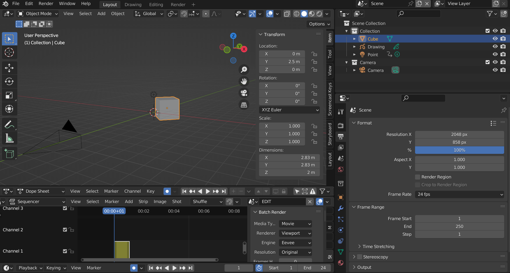
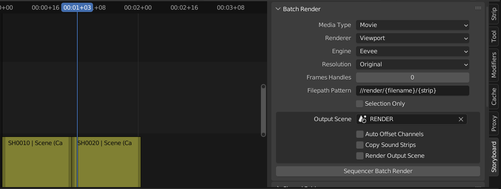
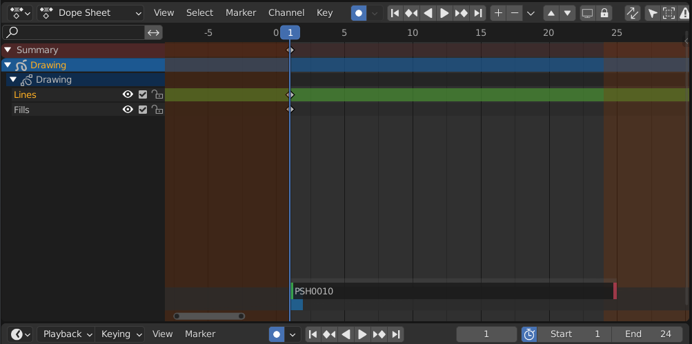

# Introduction

At SPA we are developing our own studio-specific Blender with a set of UI changes and tools to ease newcomers to it and continue refining its capabilities based on your direct production feedback.

**This document aims to give you the basic knowledge to quickly start Layout in Blender at SPA**.

## Open SPA Previz Template

The first time you launch Blender you will be see the Blender Splash Screen. On the right is a list of recent files, on the left is templates to create a new file from. To get started in the SPA Animation experience select `<strong>SPA Previz</strong>` template.

[](./images/gallery/2022-10/image-1664808321149.png)

After launching the template you will see the default SPA Previz workspace. This workspace is opened to a 3D workspace you may be familiar with.

[](./images/gallery/2022-09/image-1663199988974.png)

## Your first shot

A shot is a container that points to a specific camera at a specific time in your blender scene. A sequence is composed of multiple shots, pointing to multiple cameras. Each camera can be used at different points in time, some cameras are reused multiple times.

Shots are used to edit a sequence based on the action in your scene. Use Blender’s Sequencer to add a new shot. To get started from the Sequencer header Menu find <span class="c7">**Shot &gt; New**.</span> *<span class="c22">For more detail on how to add Shots see </span><span class="c7 c22">[Understanding Shots](#understanding-shots) </span>*

[](./images/gallery/2022-09/image-1663200154380.gif)

## Editing Toolbar

The toolbar can be found by hitting T on your keyboard or navigating to **View&gt;Toolbar** in the toolbar you can find the selection tool and the blade tool.

[](./images/gallery/2022-09/image-1663246870167.png)

## Load Reference Video into Sequencer

1. Move your sequence clips up to the second channel by using Y and moving your mouse upwards.
2. Create a new Movie clip by going to **Add&gt;Movie**
3. You can select a channel in the loader settings on the Right side of the pop up
4. Your reference is now in the sequence
5. View your reference in the same area as your sequencer by enabling **View&gt;Preview as Background**

[](./images/gallery/2022-09/image-1663201136621.gif)

## Switching a Shots Camera

Each shot in the sequencer is linked to a scene and a camera. You can see a list of these shots and their corresponding data under the sequencer panel. This is a comprehensive list of all the shots in your edit, the highlighted shot being the active shot on the current frame.

<span class="c11 c48 c7">When a shot is highlighted its properties become available to modify; scene, camera and focal length. For example if you want to change the camera assigned to SH0010, navigate to the shot SH0010 in the sequencer. Find the **Layout**&gt;**Sequence** side panel**.** Select a new camera from the **Camera** dropdown menu.</span>

[](./images/gallery/2022-09/image-1663202161165.gif)

## Rendering your Sequence

<span class="c35 c50">Rendering is the process of exporting the final frames of animation from the editing area into either Movie or Image files. This rendering workflow allows simple batch rendering of all or selected shots in the </span><span class="c7 c9">[Sequencer](https://docs.blender.org/manual/en/latest/editors/video_sequencer/sequencer/index.html?highlight=sequencer)</span><span class="c11 c35 c39">. The render area allows for playback of the rendered images.</span>

[](./images/gallery/2022-09/image-1663201894353.png)

1. Navigate to the [**Sequencer**](https://docs.blender.org/manual/en/latest/editors/video_sequencer/sequencer/index.html?highlight=sequencer)&gt;**Storyboarding Panel** in Editing area
2. Set the following settings under **Batch Render**
    - Set media type: Images or Movie. *This will define the output file type.*
    - Renderer: *Viewport=Faster Internal=Standard Render Engine*
    - OutputScene: *This output is usually RENDER or SEQ Render*
    - File Pattern: *output to a folder called render at the location of the blend file*
    - Selection Only: *only render highlighted clips from the sequencer.*
    - Select **Sequencer Batch Render** to begin rendering
3. Once complete the user will see the completed files in the Render area **tab**


# Editing & Rendering


# Understanding shots

<span class="c1">A Previz sequence can be composed of a single “shot” or multiple “shots”.</span>

A shot is a container that points to a specific camera at a specific time in your blender scene. A sequence is composed of multiple shots, pointing to multiple cameras. Each camera can be used at different points in time, some cameras are reused multiple times.

Shots are used to edit a sequence based on the action in your scene. Use Blender’s Sequencer to add a new shot. To get started from the Sequencer header Menu find <span class="c7">**Shot &gt; New**.</span> *<span class="c22">For more detail on how to add Shots see </span><span class="c7 c22">[Managing Shots](#bkmrk-managing-shots) </span>*

[](./images/gallery/2022-06/image-1656524650679.gif)

In most cases during Previz a Blend file will contain one Scene where all action occurs, any shots in the sequence will point to this same Existing Scene. In this case each shot or strip represents both a ‘Camera’ and ‘a point in time’ within an existing scene.

<span class="c22">Shots can also point to a different Blender Scene. Shots that point to different scenes is an advanced topic, covered later in the document. *See [Switch a Shot's Scene](#bkmrk-switch-a-shot%E2%80%99s-came) for more information*</span>

- - - - - -

### <span class="c11 c48 c7">Navigating Between Shots</span>

The 3D Viewport and Dope Sheet timeline interfaces can be<span class="c1"> synchronized with the master play-head from the Sequencer. </span><span class="c1">When scrubbing from scene to scene in the sequencer, the corresponding scene content will be shown into the 3D Viewport and Dope Sheet.</span>

<p class="callout info"><span class="c1">Pay attention to the difference in behavior between scrubbing or using arrow keys in each area (Dope Sheet or Sequencer)</span></p>

1. **<span class="c7">Using the Sequencer</span>** scrub or play to navigate between shots.
    

    <span class="c1">
    </span>
2. **<span class="c7">Using the Dope Sheet</span>**, navigating frame by frame with the arrow keys, the next shot will load after the final frame. <span class="c22 c30">(only frame by frame not scrubbing)</span>[](./images/gallery/2022-06/image-1656524874274.gif)

    <span class="c29 c30 c22 c47">
    </span>
3. **<span class="c7">Using the Dope Sheet</span>** scrub the timeline to remain in that current camera’s view. <span class="c30 c22">(only scrubbing not frame by frame)
    </span>

- - - - - -

### <span class="c11 c48 c7">Switch a Shot’s Camera</span>

<span style="font-weight: 400;">Each shot in the sequencer is linked to a scene and a camera. </span><span style="font-weight: 400;">You can see a list of these shots and their corresponding data under the sequencer panel. This is a comprehensive list of all the shots in your edit, the highlighted shot being the active shot on the current frame. </span>

<span class="c11 c48 c7"><span style="font-weight: 400;">When a shot is highlighted its properties become available to modify; scene, camera and focal length. For example if you want to change the camera assigned to SH0010, navigate to the shot SH0010 in the sequencer. Find the </span>**Layout**<span style="font-weight: 400;">&gt;</span>**Sequence** <span style="font-weight: 400;">side panel</span>**.**<span style="font-weight: 400;"> Select a new camera from the </span>**Camera** <span style="font-weight: 400;">dropdown menu.
</span></span>

[](./images/gallery/2022-06/image-1656525092439.gif)

- - - - - -

### Switch a Shot’s Scene

<span class="c11 c48 c7"><span style="font-weight: 400;">In the **Layout&gt;Sequence** panel there is a list of all Shots and their corresponding scenes/cameras described in [Switching Shot's Camera](#bkmrk-switch-a-shot%E2%80%99s-came). When a shot is highlighted it's scene can be edited. Navigate to the shot you want to change in the sequencer. Inside the **Layout**&gt;**Sequence** side panel**.** Select a new scene from the Scene dropdown menu. *See the[ Blender Manual](https://docs.blender.org/manual/en/latest/scene_layout/scene/introduction.html) for more information on scenes.*
</span></span>

<span class="c11 c48 c7"><span style="font-weight: 400;">*[](./images/gallery/2022-06/image-1656525303765.gif)*</span></span>

# Add, Remove and Manage Shots

#### <span class="c28">New Shots</span>

<span class="c28"><span style="font-weight: 400;">To add a shot select Shot New from the </span>**Sequencer**<span style="font-weight: 400;"> Header Menu. Update the shot number, in most cases shots will be derived from the Existing scene. </span></span>

[](./images/gallery/2022-06/image-1656526073260.gif)

- **<span class="c7">Shot Name</span>** <span class="c19 c22 c29">Set a Prefix/Number/Take: </span><span class="c22">Use </span><span class="c19 c29 c22"> to get the next available shot name</span>
- **<span class="c7">Scene</span>**: <span class="c22">Use existing (</span><span class="c7 c22">most cases</span><span class="c22">) or create a new scene from a Template</span>
- **<span class="c7">Source</span>**<span class="c7 c22">:</span><span class="c22"> Available scenes + templates: </span><span class="c22 c44">(more about 2D templates </span><span class="c7 c44 c22">TBD)</span>
- **<span class="c10 c7">Duration </span>**<span class="c5"> - </span><span class="c5 c42 c22">Set the duration in frames</span>
- **<span class="c10 c7">Channel </span>**<span class="c5">- </span><span class="c5 c22">Select a row (aka channel) to place this new clip on, in the Sequencer</span>

- - - - - -

#### <span class="c28">Duplicate Shot</span>

<span class="c28">When Duplicating a shot, the selected contents are appended to the end of your timeline, this also means that these clips are shifted in the Dope Sheet. *To duplicate a shot without adjusting its timing in the Scene world use Shift + D.* </span>

[](./images/gallery/2022-06/image-1656526232939.gif)

- - - - - -

#### <span class="c11 c38 c7 c30">Delete Shot
</span>

Each shot is associated with a scene. To delete a shot normally simply select <span class="c7">Shot&gt;Delete </span>and leave <span class="c7">Delete Scenes</span> unchecked or<span class="c7"> </span>hit ‘<span class="c7">X</span>’ on the keyboard. To remove a shot and the associated scene use <span class="c7">Shot&gt;Delete</span> and check the <span class="c7">Delete Scenes</span> option.

[](./images/gallery/2022-06/image-1656526329590.gif)

<p class="callout warning"><span class="c22">Warning: **<span class="c7">Delete Scenes</span>** option will remove associated Scene data from the outliner.</span></p>

- - - - - -

#### <span class="c11 c7 c30 c38">Adjust Shot’s Timing</span>

<span class="c11 c7 c30 c38">Adjust timing will change the length of a strip in the sequencer and in the Dope Sheet. Adjust Timing affects only one clip at a time. *To adjust timing of multiple shots at the same time see [Roll an Edit](#bkmrk-roll-an-edit)*</span>

[](./images/gallery/2022-06/image-1656526375280.gif)

- - - - - -

#### <span class="c11 c38 c7 c30">Rename a Shot</span>

<span class="c11 c38 c7 c30">To rename a shot use **<span class="c7">Shot&gt;Rename</span>**. This will work on a single shot at a time, use the  to get the next available shot number. Check the rename scene to also rename the scene associated with this strip.</span>

[](./images/gallery/2022-06/image-1656526403672.png)

- - - - - -

#### <span class="c11 c38 c7 c30">Rename All Shots</span>

After editing your shot names may be out of order. To reset the numbering of all shots use <span class="c7">**Shot&gt;Cleanup&gt;Chronological Numbering**. </span>This will rename all shots based on the specified naming convention. Scenes can also be renamed by selecting a scene rename policy.<span class="c49"> </span>

[](./images/gallery/2022-06/image-1656526426914.gif)

# Refining your Edit

<span class="c5"><span class="c35 c50">Using the Editing Workspace, refinements can be made to edit using Blender’s </span><span class="c35 c7">[Sequencer](https://docs.blender.org/manual/en/latest/editors/video_sequencer/sequencer/index.html)</span><span class="c35 c50">. </span><span class="c11 c39 c35">The Editing area can be used to refine your edit and add effects/transitions as needed.</span></span>

[](./images/gallery/2022-06/image-1656525810413.gif)

**<span class="c5"><span class="c11 c39 c35">Before you begin ensure you have the Editing Workspace selected from the header.</span></span>**

- - - - - -

### <span class="c11 c48 c7">Edit a Shot‘s Duration</span>

<span class="c11 c48 c7"><span class="c7">**Dope Sheet**:</span> Select one of the frame handles at the bottom of the Grease Pencil timeline and drag.
</span>[](./images/gallery/2022-06/image-1656525859956.gif)

<span class="c7">**Sequencer**:</span> Select a frame handle with a mouse. Hit ‘G’ on the keyboard, move the mouse.[](./images/gallery/2022-06/image-1656525882321.gif)

- - - - - -

### <span class="c11 c28 c7 c57 c60">Slipping a shot</span>

<span class="c1">A slip edit means adjusting the in and out points of a clip simultaneously by the same amount in the same direction keeping the total duration of the clip the same. The clips start and end points within the Dope Sheet will change, but not on the sequencer.</span>

From the Dope Sheet select the handle on top of the clip and drag.

[](./images/gallery/2022-06/image-1656525927261.gif)

- - - - - -

### <span class="c11 c28 c7 c57 c60">Roll an edit</span>

<span class="c11 c28 c7 c57 c60">A roll edit adjusts the start point and the endpoint of two adjacent clips simultaneously. Do this if you want to move an edit and also adjust the shot’s timing in the Dope Sheet.</span>

<span class="c11 c28 c7 c57 c60"></span>

- - - - - -

### <span class="c28">Managing Shots</span>

#### <span class="c28">New Shots</span>

<span class="c28"><span style="font-weight: 400;">To add a shot select Shot New from the </span>**Sequencer**<span style="font-weight: 400;"> Header Menu. Update the shot number, in most cases shots will be derived from the Existing scene. </span></span>

[](./images/gallery/2022-06/image-1656526073260.gif)

- - - **<span class="c7">Shot Name</span>** <span class="c19 c22 c29">Set a Prefix/Number/Take: </span><span class="c22">Use </span><span class="c19 c29 c22"> to get the next available shot name</span>
        - **<span class="c7">Scene</span>**: <span class="c22">Use existing (</span><span class="c7 c22">most cases</span><span class="c22">) or create a new scene from a Template</span>
        - **<span class="c7">Source</span>**<span class="c7 c22">:</span><span class="c22"> Available scenes + templates: </span><span class="c22 c44">(more about 2D templates </span><span class="c7 c44 c22">TBD)</span>
        - **<span class="c10 c7">Duration </span>**<span class="c5"> - </span><span class="c5 c42 c22">Set the duration in frames</span>
        - **<span class="c10 c7">Channel </span>**<span class="c5">- </span><span class="c5 c22">Select a row (aka channel) to place this new clip on, in the Sequencer</span>

- - - - - -

#### <span class="c28">Duplicate Shot</span>

<span class="c28">When Duplicating a shot, the selected contents are appended to the end of your timeline, this also means that these clips are shifted in the Dope Sheet. *To duplicate a shot without adjusting its timing in the Scene world use Shift + D.* </span>

[](./images/gallery/2022-06/image-1656526232939.gif)

- - - - - -

#### <span class="c11 c38 c7 c30">Delete Shot
</span>

Each shot is associated with a scene. To delete a shot normally simply select <span class="c7">Shot&gt;Delete </span>and leave <span class="c7">Delete Scenes</span> unchecked or<span class="c7"> </span>hit ‘<span class="c7">X</span>’ on the keyboard. To remove a shot and the associated scene use <span class="c7">Shot&gt;Delete</span> and check the <span class="c7">Delete Scenes</span> option.

[](./images/gallery/2022-06/image-1656526329590.gif)

<p class="callout warning"><span class="c22">Warning: **<span class="c7">Delete Scenes</span>** option will remove associated Scene data from the outliner.</span></p>

- - - - - -

#### <span class="c11 c7 c30 c38">Adjust Shot’s Timing</span>

<span class="c11 c7 c30 c38">Adjust timing will change the length of a strip in the sequencer and in the Dope Sheet. Adjust Timing affects only one clip at a time. *To adjust timing of multiple shots at the same time see [Roll an Edit](#bkmrk-roll-an-edit)*</span>

[](./images/gallery/2022-06/image-1656526375280.gif)

- - - - - -

#### <span class="c11 c38 c7 c30">Rename a Shot</span>

<span class="c11 c38 c7 c30">To rename a shot use **<span class="c7">Shot&gt;Rename</span>**. This will work on a single shot at a time, use the  to get the next available shot number. Check the rename scene to also rename the scene associated with this strip.</span>

[](./images/gallery/2022-06/image-1656526403672.png)

- - - - - -

#### <span class="c11 c38 c7 c30">Rename All Shots</span>

After editing your shot names may be out of order. To reset the numbering of all shots use <span class="c7">**Shot&gt;Cleanup&gt;Chronological Numbering**. </span>This will rename all shots based on the specified naming convention. Scenes can also be renamed by selecting a scene rename policy.<span class="c49"> </span>

# Render your Previz Sequence

<p class="callout warning"><span class="c37"><span class="c35 c50"><span style="text-decoration: underline;">Note
</span>When you publish your file, a sequencer render will be generated and uploaded to ShotGrid with all the proper burned in informations. **The pipeline recommended way of rendering is** <span style="background-color: #ff99cc;">**to do a publish** (TODO: link to publish section)</span></span></span></p>

<span class="c37"><span class="c35 c50">Rendering is the process of exporting the final frames of animation from the editing area into either Movie or Image files. This rendering workflow allows simple batch rendering of all or selected shots in the </span><span class="c7 c9">[Sequencer](https://docs.blender.org/manual/en/latest/editors/video_sequencer/sequencer/index.html)</span><span class="c11 c35 c39">. The render area allows for playback of the rendered images.
</span></span>[](./images/gallery/2022-06/image-1656526578363.gif)

1. <span style="font-weight: 400;">Navigate to the </span>[**Sequencer**](https://docs.blender.org/manual/en/latest/editors/video_sequencer/sequencer/index.html)<span style="font-weight: 400;">&gt;</span>**Storyboarding Panel**<span style="font-weight: 400;"> in Editing area</span>
2. <span style="font-weight: 400;">Set the following settings under </span>**Batch Render**
    - <span style="font-weight: 400;"> Set media type: Images or Movie. </span>*<span style="font-weight: 400;">This will define the output file type.</span>*
    - <span style="font-weight: 400;"> Renderer: </span>*<span style="font-weight: 400;">Viewport=Faster Internal=Standard Render Engine</span>*
    - <span style="font-weight: 400;"> OutputScene: </span>*<span style="font-weight: 400;">This output is usually RENDER or SEQ Render</span>*
    - <span style="font-weight: 400;"> File Pattern: </span>*<span style="font-weight: 400;">output to a folder called render at the location of the blend file</span>*
    - <span style="font-weight: 400;">Selection Only: </span>*<span style="font-weight: 400;">only render highlighted clips from the sequencer.</span>*
    - <span style="font-weight: 400;">Select </span>**Sequencer Batch Render**<span style="font-weight: 400;"> to begin rendering</span>
3. Once complete the user will see the completed files in the Render area **tab**

<p class="callout warning">***<span style="font-weight: 400;">Ensure your viewport is in </span>*[*<span style="font-weight: 400;">rendered mode</span>*](https://docs.blender.org/manual/en/latest/editors/3dview/display/shading.html)*<span style="font-weight: 400;"> when performing a viewport render.</span>***</p>

# Import and Conform Sequence from Editorial

SPA Blender allows us to Import a sequence from editorial and automatically generate a sequence of storyboard panels from it. To begin you will need an AAF file from editorial.

[](./images/gallery/2022-10/image-1664815099224.gif)

1. Open Blender and Navigate to the Sequencer Region
2. From the Sequencer header select **Editorial&gt;Timeline I/O&gt;Import Timeline** to import an AAF into Sequencer
3. Enter the AAF path into the file browser and confirm
4. With your edit imported select **Editorial&gt;Conform&gt;Generate Shots from Panel** to create scene strips from the editorial sequence.

# Setting Frame Range for Render

In sequence workflow, we have many different scenes inside a single blend file. To adjust the timing of your sequence's final render, the **EDIT** scene needs to have it's frame range adjusted. Because the Sequencer workflow uses the **EDIT** scene, we can set the frame range directly in the sequencer area.

[](./images/gallery/2022-10/image-1666957910608.gif)

*To Learn More about Render Range see [**Differences between Render Range and Preview Range**](#differences-between-render-range-and-preview-range)*

1. Select all strips in your sequence
2. Navigate to the Sequencer area's header
3. Selected **View&gt;Range&gt;Set Frame Range to Strips**

# Setups, Scenes and Collections


# Understanding the Sequencer Workflow at SPA

The sequencer workflow at SPA leverages Blender scenes to manage data.

An **EDIT** scene is created for you and it will only contain the **Scene Strips** that make up the current edit.

To use the sequencer workflow, your sequencer region's active scene <span style="color: #339966;">(green area)</span> must be set to this special **EDIT** scene.

When correctly set, and Synchronization enabled, the rest of your Blender window will update contextually to the current strip's scene content <span style="color: #ff0000;">(red areas)</span> . It's magic!

[](./images/gallery/2022-09/image-1664214985782.png)

- <span style="color: #ff0000;">**Current Scene:** </span>Current scene that is being viewed in the viewport. All regions highlighted in <span style="color: #ff0000;">**Red**</span> above reflect data from the current strip's scene.
- <span style="color: #339966;">**Master Scene:** </span>The Scene usually called "**EDIT**" that contains the strips that make up this files sequence. The edit region is highlighted in **<span style="color: #339966;">Green </span>**<span style="color: #339966;"><span style="color: #000000;">above.</span></span>
- **<span style="color: #3366ff;">Output Scene</span>:** A blank scene usually called **"RENDER"** which contains the final exported clips.

- - - - - -

## Override Sequencer Region Scene

Ensure these settings are set to be in the correct sequencer setup.

[](./images/gallery/2022-09/image-1664205933705.gif)

1. **Sequencer Region**: Set scene to **EDIT**
2. **Master Scene** set to **EDIT**

- - - - - -

## Creating new Blank Scene

In some cases, when Blender files do not already contain a RENDER or EDIT scene users may need to manually create new scenes.

Follow these steps to create a new Scene to use in the Sequencer Region.

[](./images/gallery/2022-09/image-1664206180673.gif)

1. At the top of your Blender window selected the **Duplicate Scene** Button
2. **Copy Settings** from current Scene
3. Rename to desired name (**EDIT, RENDER)**
4. Moving the Sequencer will return you the the original scene (if sync is enabled)

<p class="callout warning">You must have more than one scene available in your blender file to add scene strips. If you cannot add Blender Scenes please follow **Create a New Blank Scene** guide to create an **EDIT** scene.</p>

- - - - - -

## Rendering to an Output Scene

Output scenes will contain a rendered copy of your edit. Output scenes are used to review and finalize your edit. You can use your output scene to add transitions and effects to the rendered strips.

[](./images/gallery/2022-09/image-1664206405704.png)

- Ensure **Output Scene** is set to a blank scene like **Render**

# Understanding Scenes & Collections

## Important Terminology

### <span class="c21">Scene</span>

<span class="c3">A Scene in the context of Blender is an environment that contains one or more collections. By default you are always working in at least one scene. Having more than one is a way to organise lots of collections. So if collections contain objects, we can think of our Scene as a kind of theatre stage where our objects can be placed.</span>


[#scene-setups](#scene-setups "Click here for further information")

### <span class="c21">Strip</span>

<span class="c3">A strip in the Video Sequence Editor works like a movie strip in any movie editor you are used to; like in iMovie. Instead of containing a video, Green Strips in Blender are ‘Scene Strips’ and represent different scenes at different times. This allows us to cycle through multiple stages or groups of objects from the sequence perspective.
</span>


### <span class="c21">Collection</span>

<span class="c3">A Collection is a container used for grouping elements in the outliner that we are using in the 3D viewport.</span>

## 

[Collections](#collections)

# Scene Setups

<span class="c3">Are Scenes Setups used for creating new Collections inside a reused Setp containing specific elements we don't want to share from shot to shot. </span>


- - - - - -

## Identify "Same as Camera" Shots

<span class="c3">3D Previz creates its master blender files based on sequences, environments and division of work among the artists. 2D Layout will create its master Blender files based on sequences, task assignments (Background or Character posing), division of work (shot assignment) and CAM position. Those CAM position will define the amount of 2D setups we will need to create for our sequences.

A 2D setup is the scene based on the shooting camera. These can work for single shots (one offs) or various (masters &amp; reuses). Although the Previz artists will try and utilize same as cameras/bg’s as much as possible in the 3D phase, spotting opportunities for reusing material is an important tasks we need to address at 2D Layout. Not only it will be saving time for ourselves, but also later on during BG painting.

We can spot those Same as CAMs in N Panel/ Layout/ ShotCams:</span>


<span class="c43 c26 c36">Ex: PSH0140, PSH0160 &amp; PSH0180 are sharing the same Shot CAM &amp; Scene:</span>

- <span class="c43 c26 c36">0140 being the master</span>
- <span class="c43 c26 c36">0160 being a perfect reuse</span>
- <span class="c43 c26 c36">0180 being a reuse containing a child of scene</span>

<span class="c3">For shots sharing same as CAMs we should always try to reuse our 2D set ups. </span><span class="c3">Ultimately if they don´t work we will be creating a new Scene Setup and redoing them, but we don't want to work the o</span><span class="c3">ther way around.</span>

<p class="callout info"><span class="c3"><span class="c63">Note: Child Scene Setups can be created recursively many times, a new Child setup will always contain the current scene plus an additional collection not shared back to its parent.</span></span></p>

### <span class="c26 c50 c30 c54">Master Scene, straight forward reuses &amp; Child of </span><span class="c26 c50 c30 c54">Setups</span>

Master are Scene Setups containing Collections of GPOs working for Same as CAMs in different shots.
The Master will be the original Scene towards which the reuses are pointing. We will be creating this Master the same as any other Setup and then this is how we create a straight forwards reuse.<span class="c3">

In the same ex:
B0140 is the Master 2D Setup Scene for PSH0140 and is being used in PSH0160 as straight forward reuse, meaning every element in the scene is the same.
This is how both PSH0140 &amp; PSH0160 look in the outliner.</span>


<span class="c3"> </span>

# Collections

Before we continue on how we will be using Masters and reuses we need to understand Collections and how we use them. Collections are containers for keeping everything tidy inside our shots: is the way we group elements. In 2D Layout these group collections

##### **<span class="c37 c26 c30">Shot Scene Collection</span>**

We group and name these elements based on: task/shot Number/elements
In the same ex:

- **<span class="c30">B0140</span>**: “B” after BG tasks, it´s the Shot Scene Collection for P(Previz)SH(Shot)0140. In the following example.
- **<span class="c30">C0140</span>**: “C” after CH posing task, it´s the Shot Scene Collection for P(Previz)SH(Shot)0140.
    

##### <span class="c26 c30 c37">Elements inside our Collections</span>

<span class="c36 c30">Grease Pencil Objects (GPOs) &amp; cards </span><span class="c36 c30">like:</span>

- <span class="c30">BG</span><span class="c3">: Layers of drawings Overlay (OL) 01 (being the closest OL to CAM) up to OL09 (for example, being the farthest to CAM).</span>
- <span class="c30">Character Collections</span><span class="c3">: characters, animated or not. If there are.</span>
- <span class="c30">Props Collections</span><span class="c3">: objects that have interaction with characters. If needed.</span>
- <span class="c30">FX Collections</span><span class="c3">: Special effects. If needed.</span>
- <span class="c30">Others:</span><span class="c3"> reference material. If needed.

    Link to [Naming Convention](#conventions-and-details "Conventions & Details") to learn more about this.</span>

# Shared folders

They can also be used as containers for element we want to share between shots. Since we are using Scene Collections as the main tool for this purpose, shared folders can carry other type of information (maybe reference material) so they can also be shared between shots that don't share Scenes. Consider that shared material, like objects in a shared folder, can only be oriented towards one single camera, and will appear not facing other Shot CAMs different than the one you´ve originally shared with.
This is how we create them.


1. <span class="c40">To add an existing </span>**<span class="c59 c30">Shared Folder</span>**<span class="c4"> to a new Shot Navigate to the unlinked shot.</span>
2. <span class="c4">Set the link icon to active</span>
3. <span class="c40">The content of that </span>**<span class="c30 c59">Shared Folder</span>**<span class="c4"> should now be available in the outliner.</span>

# Check Object's Usage in Sequence

Objects can report which scenes they are being used by. To report an object's usage select that object in your viewport.

[](./images/gallery/2022-09/image-1664540235167.gif)

1. Select Object
2. Navigate to **Properties&gt;Object Properties&gt;Sequencer Usage**
3. Select the **Report Object use by Sequencer** button
4. A pop up will appear listing that object's usage.

<p class="callout info">This information is also stored in the **Info** log. Open the **Info** region to read previous **Object Reports.**</p>

# Grease Pencils Objects


# Understanding Grease Pencils

### <span class="c21">Object and layer</span>

<span class="c3">The GPO is both the container and the content of our drawings. </span>


- <span class="c30 c62">The object</span><span class="c3"> itself is the container: the plane into space.</span>
- <span class="c30 c64">The layers</span><span class="c3"> is the content: our drawings</span>

<span class="c3">It's important that we understand this since now we are living in a 3D environment and we will be able to animate on both. Ex: a character moving towards CAM can be now animated
</span>

- - - - - -

### <span class="c21">Line &amp; fill</span>

Layers work the same way as in PhotoShop (PS). You can create as many as you needed for your own workflow, but please remember when delivering try to stay as simple and organised as possible. Usually line &amp; fill would be enough.

Blender allows us to key also in specific layers. To draw on a layer ensure it’s highlighted in the Drawings toolbox. Keep in mind that this can be useful for creating effects (light, glow…).
<span class="c3">
</span>

- - - - - -

### <span class="c21">Materials</span>

At the beginning of each sequence we will need to create the materials we will be using. Materials will be basically the grayscale tint we will be using for our drawing: lines and fills.
<span class="c3">
Pipeline team is working on creating default Material Libraries for different uses inside the production, including one specific for 2D LO.</span>

<span class="c3"> I recommend working with a list similar to this one:</span>

- <span class="c3">100% black (line) for drawing,</span>
- <span class="c3"> blue &amp; red (line) for grids &amp;</span>
- <span class="c3"> 5 to 7 range of grayscale tones</span>
- <span class="c3">(fill) to fill the drawing.</span>

Unfortunately, for the moment we will have to create our owns when beginning a new sequence.Name it: <span class="c36">Layout/whatever it needs to be</span> (ex: <span class="c36">Layout/30% fill</span>) and Blender will save it for your next shots.

# Creating Grease Pencils

```
TODO: insert illustration here
```

Our Scenes or 2D set ups are made of GPO´s: 2D drawings (planes) translating the 3D set up for specific CAM positions. While working on a shot every new GPO should be contained inside Collections.</span>

- - - - - -

### <span class="c21">Start working on your shot</span>

- <span class="c3"> (N Panel/Storyboard or Shift+A in Object Mode). A plane or card will be created in a specific location. It’s your choice to first set the placement and then start drawing or the other way around (cursor to CAM, then Shift+F &amp; drag).</span>
- In draw Mode (N Panel/Storyboard) click Draw. Now you can start drawing.

### 

# Moving Grease Pencils

<span class="c3">Grease Pencil objects as mentioned before are containers where all drawing information is stored. By entering Object Mode we can affect the transformation of our Grease Pencil Object in world space.</span>


1. <span class="c34 c26 c53">Select Draw from the top of the Storyboard panel to exit Draw mode</span>
2. <span class="c34 c26 c53">From the Toolbar on your Left, (open with Shortcut ‘T’) select a tool</span>
3. <span class="c34 c26 c53">Move, Rotate and Scale tools are all available</span>
4. <span class="c34 c26 c53">Your selected gizmo will appear at the “origin” of your drawing represented by a yellow dot</span>

# Rescale Grease Pencil Proportionally

<span class="c3">Our 2D Set up’s must work as a simplification of the 3D Set-up in terms of number of overlays and placement into space. This will affect mainly the parallax (if there is any) and the focus depth, and will help us gain consistency and cinematography.

On one hand we need to make our shot work (in terms of parallax, if there is) and on the other we want to stay as simple as possible for the BG and Comp departments. The balance between those two needs will determine the number of OL’s (GPOs) we should use.</span>


1. <span class="c3">Create a new GPO.</span>
2. <span class="c3">Draw the line based on the 3D Master on each one your GPO´s. Then fill it.</span>
3. Place them into its correct position in space:
4. Select Cam, cursor to active using **Shift + S**
5. **Shift+F** in order to scale (without changing the proportions from ShotCam POV.)

# Conventions and Details

# Sequencer Batch Render

## Why did my Batch Render Fail?

Sequence Batch Render will take the current scene, and render each strip from your sequencer as a clip. Sequencer Batch Render will fail if GPU Shades are not compiled. When Sequence Batch Render is set to VIEWPORT mode, and EEVEE as the render engine, we must ensure that our viewport shading settings are set to **Scene Lights + Scene World.**

[](./images/gallery/2022-09/image-1663762977049.gif)

1. Navigate to the Render Settings in Viewport
2. Select Render/Material Preview Settings
3. Enable **Scene Lights / Scene World** to compile shaders

<p class="callout info">Sequence Batch Render will not fail when using '**Workbench'** Render Engine, regardless of shader compilation</p>

- - - - - -

## Why does my Batch Render look different?

There is a difference in Blender between it's preview world and it's rendered world. Use one of the following setups to ensure you have a "What you See is What you Get" Experience, User need to align settings in Blender between the Viewport and the Renderer use one of the two following setups:

#### Workbench:

[](./images/gallery/2022-09/image-1663763417133.png)

1. Set Material Shading mode to **SOLID** view
2. Set Render Engine to **WORKBENCH**

#### **Eevee**

[](./images/gallery/2022-09/image-1663763483601.png)

1. Set Material Shading mode to **RENDERED** view
2. Set Render Engine to **EEVEE**
3. Enable **Scene Lights / Scene World**

- - - - - -

## Can I check my work before Rendering?

Using the Sequencer + Preview option in Blender we can see a preview of what objects will be rendered by the Internal Renderer.
[](./images/gallery/2022-09/image-1663764106086.gif)

1. Select **Sequencer** from the **Sequencer** Header Menu
2. Select the option **Sequencer + Preview**
3. Scrubbing the timeline will now show a Preview Window of your sequence Render in **Solid mode.**

# Differences between Render Range and Preview Range

### Frame Range

In Blender the Range is the length of each Blender Scene's timeline. To set the Range, navigate to **Scene Properties&gt;Frame Range** or in the **Timeline** area.

[](./images/gallery/2022-10/image-1666958512164.png)

- - - - - -

### Preview Range

Preview Range is a temporary range on your scene, it is used to playback small sections of a blender file. The **Sequencer** workflow uses Preview Range to indicate the beginning and end of the current shot. A preview range is a signified with a [ ](./images/gallery/2022-10/image-1666958568322.png)symbol, and an orange overlay. Preview Range doesn't impact the render Range.

[](./images/gallery/2022-10/image-1666958775088.png)


#####

##### How to disable Preview Range in Sequencer workflow?

[](./images/gallery/2022-10/image-1666959069390.gif)

1. Under **Sequencer&gt;Storyboard Panel&gt; Use Preview Range** set to disabled
2. Clear the current range by selecting the [](./images/gallery/2022-10/image-1666959113627.png) in the timeline area
